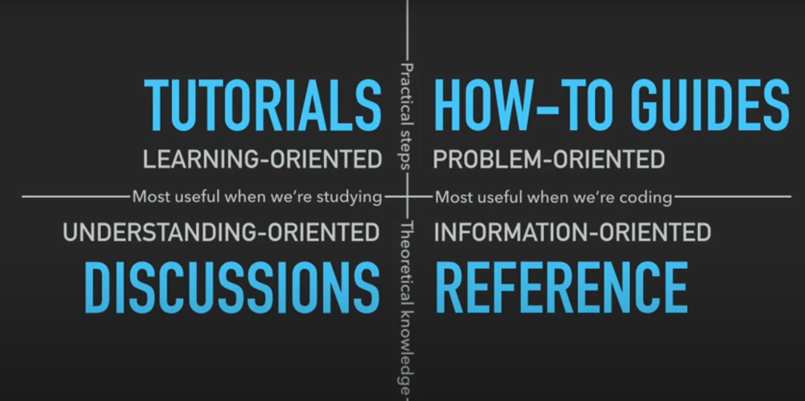

= 4 Types of documentation
:toc:

Adding new material to documentation, but in the wrong place i.e. the wrong type like a tutorial in reference documentation, will make the documentation worse and harder for readers to absorb.

.4 types of documentation grid
[caption="Screenshot from video: ",]

== 1. Tutorials

Lessons that take the reader by the hand through a series of steps to complete a project or meaningful exercise of some kind.
These are **learning-oriented**.
It needs to show the user that they can achieve something meaningful.

Important aspects (among others to be found in the video linked below):

- learning by doing
- getting started
- repeatibility
- concreteness
- immediate sense of achievement

[quote, paraphrased from video below]
When teaching a child to cook, what you teach isn't as important as them finding the experience enjoyable, gaining confidence, and wanting to come back and do it again.

== 2. How-to guides

Guide the reader through a series of steps required to solve a common problem.
These are **problem-oriented** e.g. how to enable LDAP authentication, how to access a dataset, etc.

Important aspects (among others to be found in the video linked below):

- a series of steps
- focus on the goal
- addressing a specific question
- no unnecessary explanation; explanations get in the way of action
- some flexibility - in case the user want to apply to a slightly different use case
- practical usability - much more important than completeness
- good naming

Distinction between tutorial and how-to guide is that the user does not necessarily have the knowledge to ask specific questions when using a tutorial, so the author of the tutorial decides what the problem is, what the steps to address are, and so on.
In a how-to guide, the user already knows enough to ask certain questions, and will want to follow specific steps to arrive at a solution. 

== 3. Reference

Technical descriptions of the machinery and how to operate it.
**Information-oriented.**
One job - describe.
API documentation, library documentation, etc.

Not a good place to explain common concepts or how-to do something (that is for how-to guides).

Important aspects:

- structure; same structure as the codebase
- consistency; consistent tone, language
- description; the main job - no speculation, opinion, instruction, etc.
- accuracy; must be kept up-to-date

== 4. Discussions

Explanations that clarify and illuminate a particular topic.
**Understanding-oriented.**

Important aspects:

- give context
- explaining why
- multiple examples, alternatives; multiple approaches to the same question or problem e.g. for deployment, or contrasting or conflicting opinions
- making connections
- no instruction or technical description

== Sources

- https://medium.com/better-programming/best-practices-when-documenting-your-code-for-software-engineers-941f0897aa0
- https://www.youtube.com/watch?v=t4vKPhjcMZg
