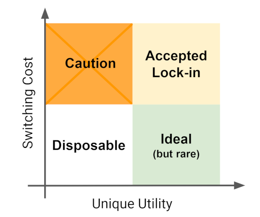
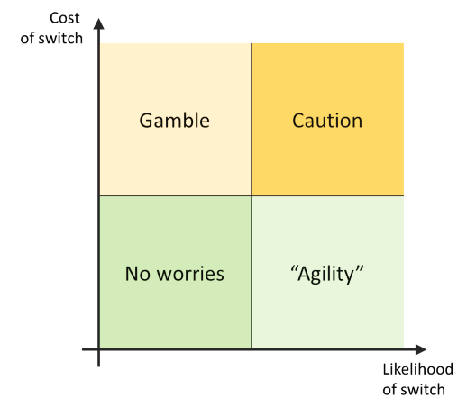
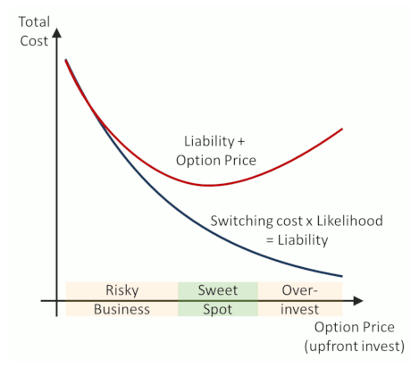

= Lock-in

Lock-in is a common discussion point when making design choices, especially stack or vendor choices.
Of course, lock-in is to a large extent inevitable, it is just a matter of deciding what _type_ of lock in is acceptable, given the trade-offs.
This is captured well in the following post:

https://martinfowler.com/articles/oss-lockin.html

The gist of the article is that:

* Open-source != no lock-in.

* There are various types of lock-in, some of which are:
** Vendor lock-in.
** Product lock-in.
** Skills lock-in.
** Mental lock-in (a certain bias based on experiences, argued to be the most dangerous).

* It is good to have simple models to lean on when making decisions in uncertain spaces.

* A few simple models are suggested for these evaluations:
** Compare *switching cost* to *unique utility*.
We want to minimize switching cost, but if a product offers some unique utility that competitors do not, we may accept the "lock-in".

** To break down switching cost a little more, compare *switching cost* to *switch likelihood*.
Anything with low switching cost is not really a concern.
The main worrisome quadrant is high switching cost/high switch likelihood, which should be treated with caution.

* Decisions should be made based on the *total cost* of an option, which is a combination of liability (switching cost x likelihood) and option price (up-front investment to minimize switching cost, e.g. architectural separations/abstractions).
_"Minimizing switching costs may not be the most economical choice."_

* Total cost involves various aspects, including but not limited to:
** Effort - person-hours.
** Under-utilization - not using a tool's full capacity because of restrictions put in place to simplify switching.
** Complexity - additional abstraction layers added to simplify switching.
_"Complexity can be the biggest price you pay for reducing lock-in."_

